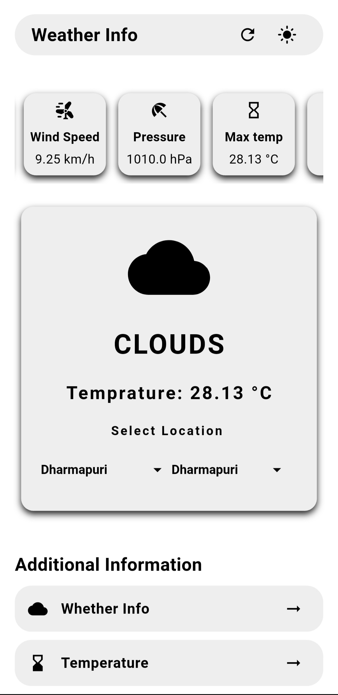
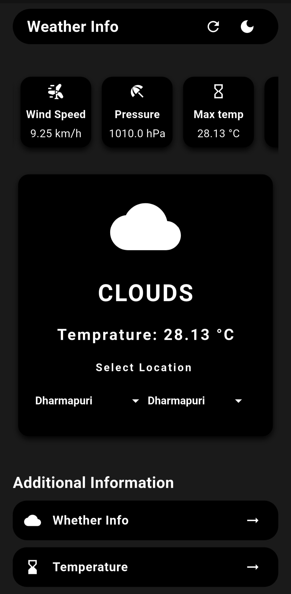

# 🌤️ Real-Time Weather App

A simple and clean **Flutter weather application** that shows real-time weather data using a public API. Built with **GetX** for state management and features **dark/light theme switching**.

---

## 🚀 Features

- 🌍 **Real-time weather** using city name
- 🌡️ Shows temperature, humidity, wind, pressure, etc.
- 🌓 **Theme toggle** (Dark / Light mode)
- 📱 Mobile responsive UI
- ⚡ Fast state management using **GetX**

---

## 📦 Tech Stack

- Flutter
- GetX (State Management + Routing)
- HTTP package
- OpenWeatherMap API 

---

## 📸 Screenshots

| Light Mode                          | Dark Mode                          |
|------------------------------------|------------------------------------|
|  |  |
